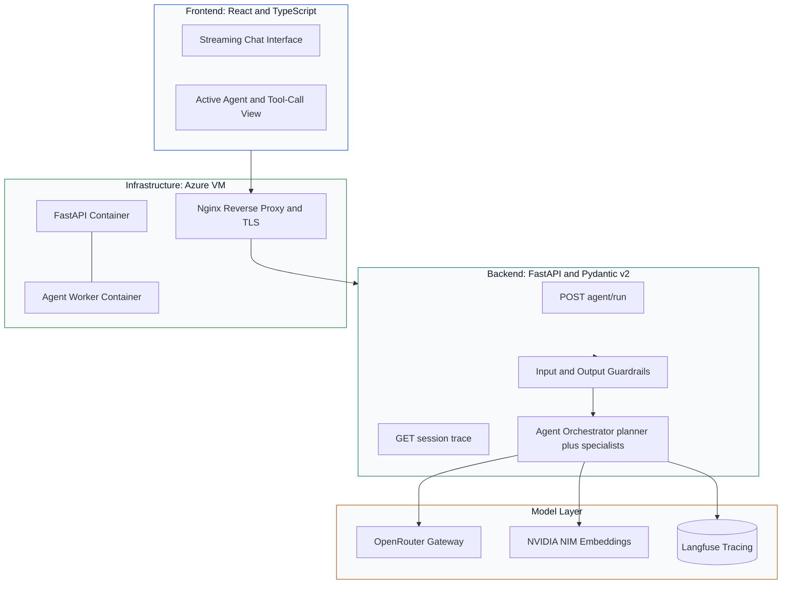
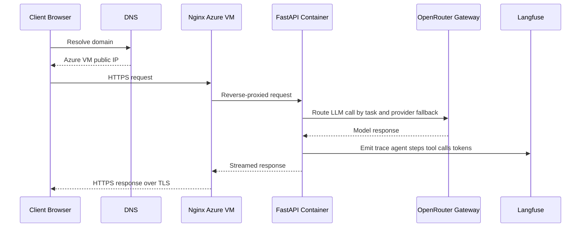

# Argus Project — Complete UI Content & Architecture Diagrams

> **URL Route**: `http://localhost:5173/projects/argus`  
> **Source Component**: [`src/components/ProjectDetail.tsx`](file:///c:/Users/Shubh/Downloads/My-Portfolio/src/components/ProjectDetail.tsx)  
> **Data Definition**: [`src/data/projectsData.ts`](file:///c:/Users/Shubh/Downloads/My-Portfolio/src/data/projectsData.ts) (ID: `argus`)

---

## 1. Hero Header & Navigation

### Breadcrumb Navigation
- `← All projects` (Link to `/#projects`)
- `/`
- `Argus` (Current page)

### Badges
- **Status Badge**: `● Production` (`badge--green` with live indicator dot)
- **Category Badge**: `Applied AI` (`badge--primary`, mapped from `internship`)

### Title
# Argus

### Key Metrics Row
| Metric Value | Metric Label |
| :--- | :--- |
| **4** | Specialist agents |
| **3+** | LLM providers via gateway |
| **Input + Output** | Guardrail layers |
| **Azure VM** | Deployment |

---

## 2. Main Content

### Key Capabilities (`Key Capabilities`)

- [x] **Planner agent** that decomposes requests and delegates to research, analysis, and writing agents
- [x] **Per-agent tool allowlists** so each agent can only call what its role needs
- [x] **OpenRouter as an LLM gateway**: provider fallback and per-task model selection instead of a single hardcoded vendor
- [x] **NVIDIA NIM-hosted embedding endpoints** for retrieval, decoupled from the generation layer
- [x] **Input guardrails**: prompt-injection pattern checks before a request reaches an agent
- [x] **Output guardrails**: Pydantic schema validation and PII redaction before responses are logged
- [x] **Full Langfuse tracing** on every agent step, tool call, and token cost, down to session-level replay
- [x] **Streaming React frontend** that shows the active agent and its intermediate tool calls
- [x] **Deployed on an Azure VM**: Docker Compose services behind Nginx, custom domain, and TLS

---

### Architecture Diagrams (`Architecture`)

#### 01 Multi-Agent Orchestration

```mermaid
flowchart TD
    A([User Request]) --> B["Planner Agent: task decomposition"]
    B --> C{Route Sub-Tasks}
    C --> D["Research Agent web and doc tools"]
    C --> E["Analysis Agent data and reasoning tools"]
    C --> F["Writing Agent drafting and formatting"]
    D --> G["Tool Allowlist Guard"]
    E --> G
    F --> G
    G --> H["Aggregator: merge agent outputs"]
    H --> I{Output Guardrail}
    I -- "Schema invalid or PII" --> J(["Reject or redact response"])
    I -- "Passes validation" --> K(["Final response to user"])
    B -.trace.-> L[(Langfuse)]
    D -.trace.-> L
    E -.trace.-> L
    F -.trace.-> L

    style A fill:#1d4ed8,color:#fff,stroke:none
    style K fill:#dcfce7,color:#14532d,stroke:#15803d
    style J fill:#fee2e2,color:#7f1d1d,stroke:#b91c1c
    style L fill:#fef3c7,color:#78350f,stroke:#b45309
```

---

#### 02 System Architecture

---

#### 03 Production Deployment

---

## 3. Sidebar

### Tech Stack
- `Python`
- `FastAPI`
- `Pydantic v2`
- `OpenRouter`
- `NVIDIA NIM`
- `Langfuse`
- `React`
- `TypeScript`
- `Docker Compose`
- `Nginx`
- `Azure VM`

### Project Info
- **Category**: `Applied AI`
- **Status**: `● Production`
- **Architecture diagrams**: `3`
