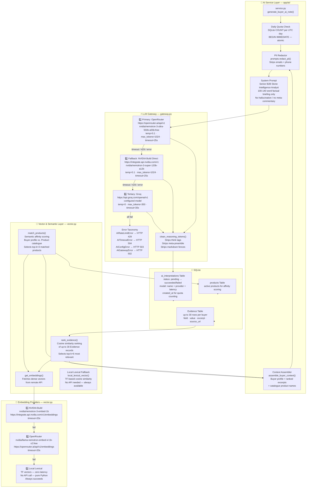
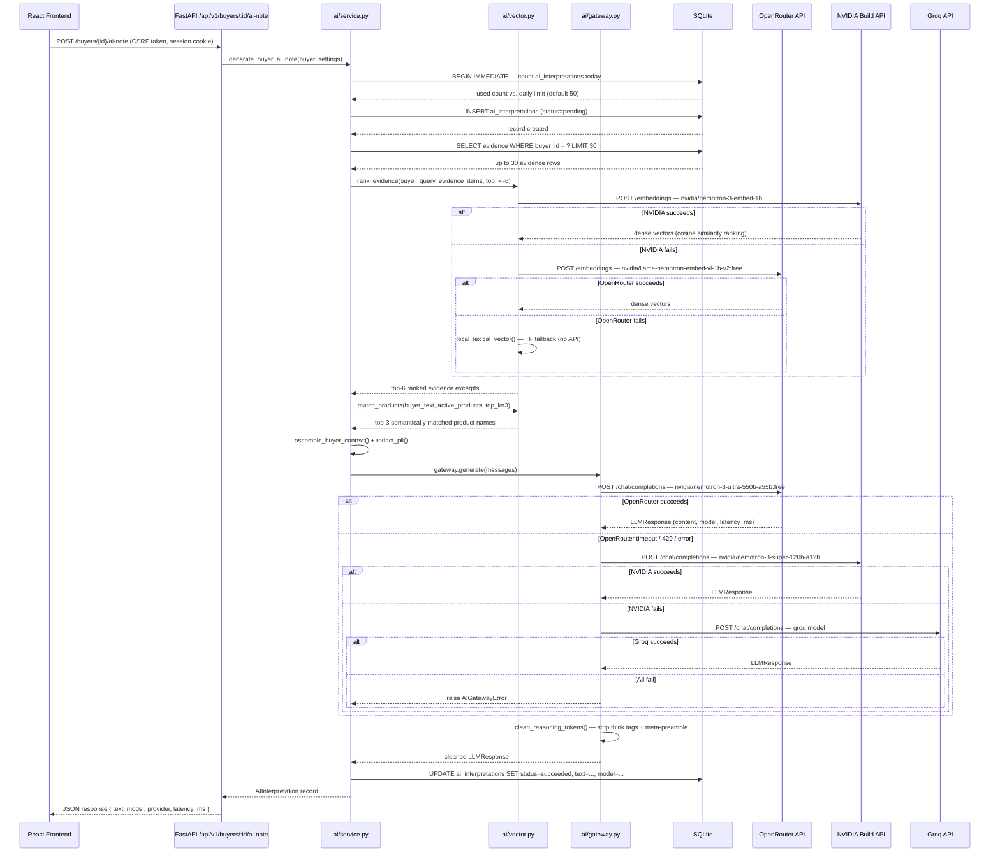
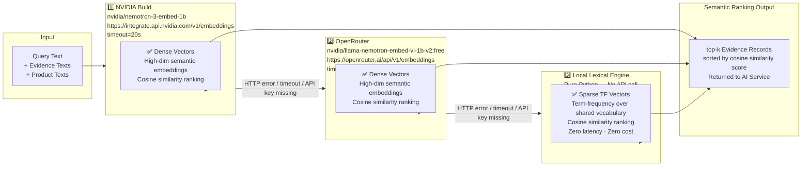
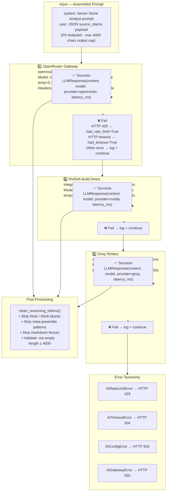

# Granite Buyer Intelligence — AI / LLM Gateway Architecture
## (Addendum to Interview Script — AI Engineer Role)

> This document corrects and expands the AI section of the interview script.
> The architecture documentation previously referenced only "Groq" — that is **inaccurate**.
> The actual implementation is a **production-grade multi-provider LLM Gateway** with
> automatic failover, vector embeddings, semantic ranking, and a local lexical fallback.

---

## What Is Actually Built — The Real AI Stack

### 3 AI Providers, Configured and Active

| Priority | Provider | Role | Model in `.env` |
|---|---|---|---|
| **1 — Primary** | **OpenRouter** (gateway) | Chat / generation | `nvidia/nemotron-3-ultra-550b-a55b:free` |
| **2 — Fallback** | **NVIDIA Build** (direct) | Chat / generation | `nvidia/nemotron-3-super-120b-a12b` |
| **3 — Tertiary** | **Groq** (legacy / direct) | Chat / generation | configured via `GROQ_API_KEY` |

### 2 Embedding Providers, with Local Fallback

| Priority | Provider | Role | Model |
|---|---|---|---|
| **1 — Primary** | **NVIDIA Build** | Dense vector embeddings | `nvidia/nemotron-3-embed-1b` |
| **2 — Secondary** | **OpenRouter** | Dense vector embeddings | `nvidia/llama-nemotron-embed-vl-1b-v2:free` |
| **3 — Always-on fallback** | **Local Lexical Engine** | Sparse TF-based vectors | No API — runs in-process |

### 1 Reranking Model (OpenRouter)

| Provider | Role | Model |
|---|---|---|
| **OpenRouter** | Reranking (future use, configured) | `nvidia/llama-nemotron-rerank-vl-1b-v2:free` |

---

## Architecture Diagrams

### Diagram 1 — LLM Gateway Architecture (Full System View)

---

### Diagram 2 — Request Execution Flow (Sequence)

---

### Diagram 3 — Embedding Provider Failover Chain

---

### Diagram 4 — LLM Chat Failover Chain

---

## How to Explain This in an AI Engineer Interview

### The 60-Second Verbal Summary

> "The AI layer is a **production-grade multi-provider LLM gateway** with two independent failover chains.
>
> For **chat generation**, I built a three-tier failover: **OpenRouter** is the primary gateway routing to NVIDIA's Nemotron-550B model. If that fails — timeout, rate limit, or API error — it automatically falls through to **NVIDIA Build direct** with Nemotron-120B. If that also fails, it falls through to **Groq** as a tertiary. All three providers use the same OpenAI-compatible `/chat/completions` API surface.
>
> For **vector embeddings**, I built a separate failover chain: **NVIDIA Build** for dense `nemotron-3-embed-1b` embeddings first, **OpenRouter** second, and a **local lexical TF-based engine** as a zero-dependency, always-on fallback. This guarantees the semantic ranking never goes down — even with no internet.
>
> Before any text touches an LLM, it goes through **PII redaction** — email addresses and phone numbers are stripped with regex. After generation, a **reasoning token cleaner** strips internal model scratchpads like `<think>...</think>` blocks from reasoning models.
>
> The whole pipeline is **quota-gated at the database level** — a daily limit counter uses an atomic `BEGIN IMMEDIATE` transaction so concurrent requests can't race past the quota. Every AI call result, model name, provider, and latency is stored in SQLite and linked back to the buyer record."

---

### Key Technical Talking Points for an AI Engineer Interview

| Topic | What to Say |
|---|---|
| **Why OpenRouter as primary?** | It's a unified API gateway that routes to multiple hosted models through one endpoint. Using `nvidia/nemotron-3-ultra-550b-a55b:free` gives access to a massive 550B-parameter model at zero direct cost, with OpenRouter handling the routing. |
| **Why NVIDIA Build as fallback?** | It gives direct access to NVIDIA-hosted Nemotron models with lower latency and no gateway intermediary. The `nemotron-3-super-120b-a12b` is strong for factual B2B text summarization. |
| **Why Groq as tertiary?** | Groq uses custom silicon (LPUs) giving extremely low token generation latency — good as a last-resort fast fallback. |
| **Why local lexical fallback for embeddings?** | A buyer intelligence system cannot go down just because an embedding API is temporarily unavailable. The local TF-based cosine similarity is deterministic, zero-latency, and requires no API call — ensuring 100% uptime for evidence ranking. |
| **How does the reasoning token cleaner work?** | Some NVIDIA reasoning models output their internal chain-of-thought inside `<think>...</think>` XML tags before the actual answer. The cleaner strips these with regex before saving the response. This prevents model scratchpads from appearing in the buyer briefing. |
| **What is the quota mechanism?** | `BEGIN IMMEDIATE` on SQLite serializes the quota check + insert. Since SQLite only allows one writer at a time under WAL mode, this prevents two simultaneous requests from both reading "49 used" and both proceeding past a limit of 50. |
| **What does PII redaction cover?** | Email addresses (regex on `@` pattern) and international phone numbers (regex on digit sequences ≥ 8 digits). This prevents buyer contact data from being transmitted to hosted AI providers during the interpretation call. |
| **What is the output constraint?** | Max 4000 characters checked after generation. The system prompt instructs 100–140 words. If the model returns empty or exceeds 4000 chars, it's treated as a failed generation and falls through to the next provider. |

---

## Corrected Summary Table

| Component | File | What It Does |
|---|---|---|
| `LLMGateway` | `app/ai/gateway.py` | Three-tier LLM failover: OpenRouter → NVIDIA Build → Groq |
| `VectorService` | `app/ai/vector.py` | Two-tier embedding failover: NVIDIA → OpenRouter → Local lexical |
| `generate_buyer_ai_note` | `app/ai/service.py` | Orchestrates quota check → vector ranking → context assembly → gateway call → DB write |
| `SYSTEM_SUMMARY_PROMPT` | `app/ai/prompts.py` | Role-grounded system prompt — stone industry analyst, factual only, 100–140 words |
| `redact_pii` | `app/ai/prompts.py` | Strips emails + phone numbers before transmission |
| `clean_reasoning_tokens` | `app/ai/prompts.py` | Strips think tags + model scratchpads from output |
| `assemble_buyer_context` | `app/ai/prompts.py` | Builds structured context from buyer profile + ranked evidence + matched products |
| `Settings` | `app/core/config.py` | Holds all API keys as `SecretStr`, computes `active_llm_provider`, `active_embedding_provider` |

