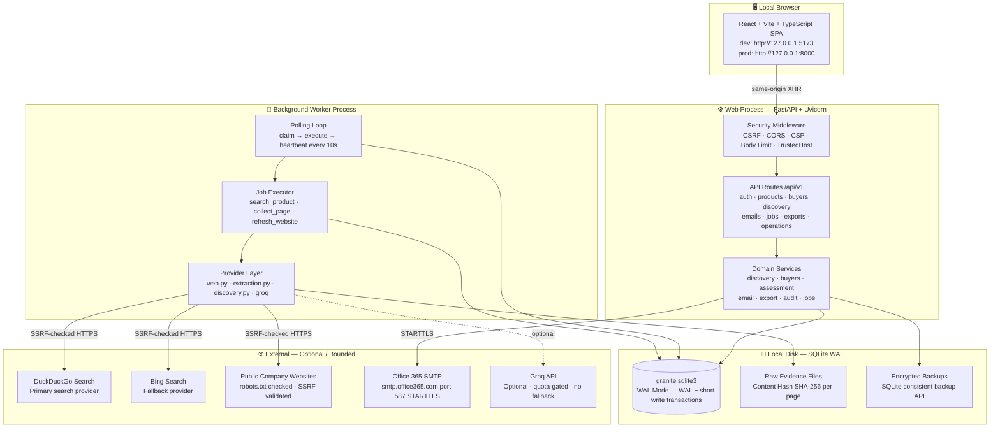
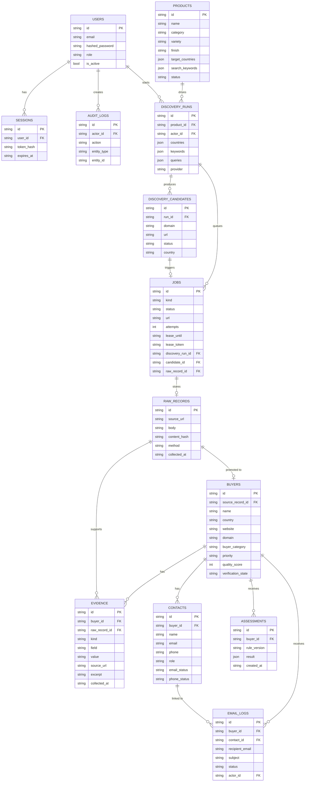
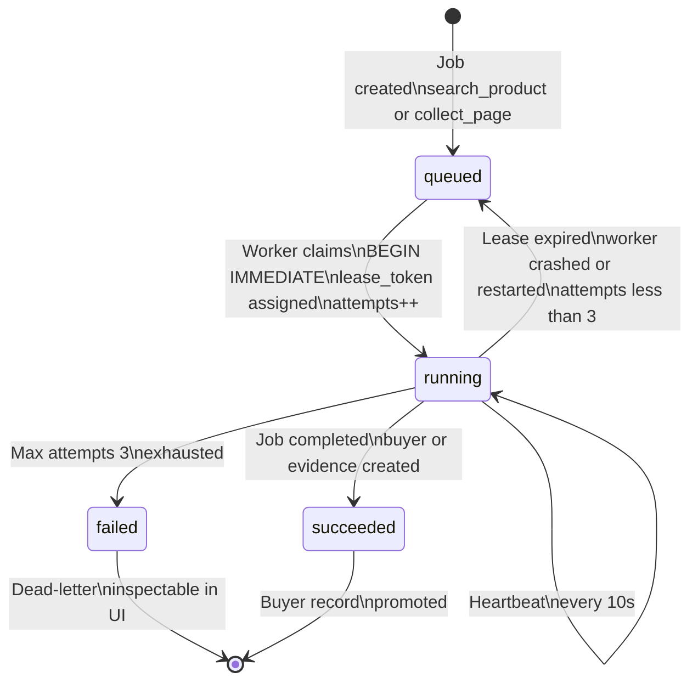

# Granite Buyer Intelligence — Interview Script (Scenario 2)

> **Usage:** This document is structured as a full interview narrative.
> Each section maps to a standard interview question. Speak naturally — do not read verbatim.

---

## 1. Problem Statement

The project I built addresses a real operational pain point in the **B2B granite export industry**.

A granite supplier — **Goldline** — exports premium Indian stone varieties: Absolute Black, Black Galaxy, and Tan Brown. They have a global addressable market, particularly in **India and the United Kingdom**, where thousands of stone importers, distributors, wholesalers, fabricators, and project contractors could be buying from them.

But their buyer research process was **entirely manual**:
- Team members Googled company names one by one
- Copied data into unstructured spreadsheets with no source tracking
- Wrote outreach emails without knowing if a contact was valid, relevant, or already contacted
- Had no audit trail, no qualification logic, and no way to export research in a standardized format

The core problem had **three layers**:

1. **Discovery** — No automated way to find potential granite buyer companies from public sources
2. **Qualification** — No evidence-backed system to assess whether a found company actually buys granite
3. **Operationalization** — No structured export, audit trail, or email workflow for the sales team

---

## 2. Objective

The goal was to build a **local-first, private buyer intelligence and lead generation platform** with these defined objectives:

| # | Objective |
|---|---|
| 1 | Automate discovery of granite buyer candidates in India and the UK from public web sources — **no paid APIs** |
| 2 | Qualify every buyer claim with a sourced, timestamped evidence record — **no invented data** |
| 3 | Support the full research lifecycle: web collection → extraction → staging → buyer profile → assessment → export |
| 4 | Run entirely on a **single local machine** — no cloud infrastructure, no Redis, no external database required |
| 5 | Optionally integrate an LLM (Groq) for interpretation — clearly separated from verified facts |
| 6 | Provide a logged, auditable **Microsoft 365 email outreach** capability per contact |

---

## 3. My Role & Contribution

> **This was a solo build project. I designed and implemented every layer end-to-end.**

| Area | My Contribution |
|---|---|
| Architecture | Designed full modular monolith covering all 9 lifecycle domains (identity, catalogue, discovery, evidence, buyers, intelligence, jobs, email, reporting) |
| Backend | Built complete Python FastAPI backend — API routes, service layer, data models, migrations, worker, CLI |
| Frontend | Built complete React + Vite + TypeScript frontend — auth, buyers, discovery, dashboard, email, settings |
| Data Pipeline | Designed and implemented: web acquisition → HTML extraction → evidence staging → buyer creation → scoring |
| Security | Argon2 hashing, opaque sessions, CSRF, SSRF controls, RBAC, parameterized ORM, audit log |
| Email Integration | Microsoft 365 SMTP integration with RFC-compliant headers, evidence trail, and audit log |
| Testing | API auth, RBAC, CSRF, SSRF/DNS-rebinding, evidence-backed intake, Excel output, AI isolation tests |
| Documentation | Architecture review, deployment guide, implementation status, decision log, progress log |

---

## 4. Dataset

### Source & Nature
All data is sourced from **publicly available web pages** — no licensed datasets, no paid data providers.

| Source | Description |
|---|---|
| Public company websites | Homepage, About, Product, Contact pages |
| Web search (DuckDuckGo → Bing fallback) | Company candidate discovery |
| User-imported URLs / CSVs | Manual operator-curated input |
| User-entered contacts | Published emails, social links, phone numbers |

### Target Geography
- **India (IN)** — Importers, distributors, wholesalers, manufacturers, fabricators, processors
- **United Kingdom (GB)** — Stone importers, contractors, project suppliers, retailers, specialists

### Data Scale (Design Target)
- ~5,000 companies planning workload
- 5–10 pages per company (bounded crawl)
- All evidence stored in **SQLite on local disk**
- Every data point tagged: source URL, extraction timestamp, parser version, evidence kind

### Data Quality Policy
- Missing values → explicit `null` + `UNKNOWN` / `NOT_VERIFIED` states (never placeholder guesses)
- Priority grades: **A / B / C / D** (evidence completeness + keyword relevance)
- Quality score: **0–100** integer per buyer record
- `FACT` vs. `AI_INTERPRETATION` distinction enforced at database level via `CHECK CONSTRAINT`

### Key Limitation
Live search returned `HTTP 202` (asynchronous acceptance, no results) during development. The pipeline mechanics were validated using **synthetic test fixtures**. Real India/UK data quality requires a live network pilot.

---

## 5. System Architecture Diagram

---

## 6. Data Pipeline — Execution Flow Diagram

```mermaid
flowchart LR
    subgraph OP["👤 Operator"]
        A["Select Product\n+ Countries\n+ Candidate Limit\n+ Policy ACK"]
    end

    subgraph DISC["🔍 Discovery Phase"]
        B["Build Search Queries\nproduct × keyword\n× buyer-role × country"]
        C["Queue search_product\nJobs in SQLite"]
        D["Worker Claims Job\nBEGIN IMMEDIATE\nlease_token assigned"]
        E["Execute Search\nDuckDuckGo → Bing fallback"]
        F["Parse Results\nExtract candidate domains"]
        G{{"Domain in DB?"}}
        H["Mark: duplicate"]
        I{{"Excluded domain?"}}
        J["Mark: rejected"]
        K["Create Candidate\n+ Queue collect_page Job"]
    end

    subgraph ACQ["🌐 Acquisition Phase"]
        L["Worker Claims\ncollect_page Job"]
        M["SSRF Check\nBlock private / loopback\n/ reserved IPs"]
        N["robots.txt Check"]
        O["Async HTTP GET\n90s timeout\n1 MB limit\n3 retries + backoff"]
        P["Store RawRecord\nbody + SHA-256\n+ timestamp"]
    end

    subgraph EXT["🧪 Extraction Phase"]
        Q["HTML Extraction\nBeautifulSoup / Scrapling"]
        R["Extract Fields\nname · description\nemail · phone · address\n· keywords"]
        S["Create Evidence Records\nkind=FACT\nsource_url · excerpt\n· timestamp"]
        T["Promote to Buyer\nif sufficient evidence"]
    end

    subgraph ASSESS["📊 Assessment"]
        U["Run Assessment\nkeyword relevance\n× completeness"]
        V["Assign Priority\nA / B / C / D\n+ reasons"]
        W["Update quality_score\n0 to 100"]
    end

    subgraph OUT["📤 Output"]
        X["Buyer in UI\nwith Evidence Timeline"]
        Y["Contact Management\nemail · phone · social"]
        Z["Excel Export\n13 worksheets via openpyxl"]
        AA["Email via\nOffice 365 SMTP"]
    end

    A --> B --> C --> D --> E --> F --> G
    G -->|yes| H
    G -->|no| I
    I -->|yes| J
    I -->|no| K
    K --> L --> M --> N --> O --> P --> Q --> R --> S --> T --> U --> V --> W --> X
    X --> Y
    X --> Z
    Y --> AA
```

---

## 7. Database Entity Relationship Diagram

---

## 8. Job Execution State Machine

> **Lease details:** `lease_until = now + 180s`. On every DB write the worker validates `lease_token` and `lease_until` to prevent stale-lease races. `available_at` controls exponential backoff between retries.

---

## 9. Tools, Frameworks & Technologies

### Backend Stack

| Layer | Tool | Why |
|---|---|---|
| Runtime | **Python 3.12+** | Typed ecosystem, async support |
| API Framework | **FastAPI** | Auto OpenAPI, Pydantic validation, async |
| ASGI Server | **Uvicorn** | Production-grade async server |
| Validation | **Pydantic v2** | `SecretStr` for credentials, strict schemas |
| ORM | **SQLAlchemy 2** | Typed mapped columns, session management |
| Migrations | **Alembic** | Versioned, frozen schema history |
| Database | **SQLite (WAL mode)** | Local embedded DB, no external server |
| HTML Extraction | **BeautifulSoup4 + Scrapling** | Static HTML + JS-rendered fallback |
| HTTP Client | **aiohttp** | Async bounded web acquisition |
| Excel Export | **openpyxl** | 13-worksheet workbook, formula-safe text |
| Password Hashing | **Argon2-cffi** | Best-practice modern password storage |
| Email Validator | **email-validator** | Contact syntax validation |
| Fuzzy Matching | **RapidFuzz** | Candidate deduplication signals |
| Groq Client | **httpx** | Async HTTP, replaceable adapter |
| Testing | **pytest + pytest-asyncio + HTTPX** | Unit, API, pipeline, security tests |
| Linting | **Ruff** | Fast Python linter and formatter |
| Package Manager | **uv** | Lock file reproducibility |

### Frontend Stack

| Layer | Tool | Why |
|---|---|---|
| Framework | **React 18 + Vite** | Fast dev server, component model |
| Language | **TypeScript** | Type-safe API contracts |
| State | **TanStack Query** | Server state, cache invalidation |
| Routing | **React Router v6** | Client-side navigation |
| Styling | **Vanilla CSS + custom design system** | No framework lock-in, full control |

### Methodology

| Principle | Implementation |
|---|---|
| Evidence-first design | Every buyer claim has a sourced, timestamped `Evidence` record |
| Modular monolith | One web process + one worker, sharing clean service layer |
| Fail-closed safety | Unknown stays `UNKNOWN`; outreach requires explicit verified conditions |
| Durable job queue | Jobs persist through restarts; leases handle crash recovery |
| FACT vs. AI separation | Enforced at DB level via `CHECK CONSTRAINT` on `evidence.kind` |

---

## 10. Process — Step-by-Step Approach

### Phase 1 — Architecture & Design *(before any code)*
- Read and synthesized the full 30-page business requirements document
- Identified constraints: local-only, no paid APIs, SQLite, open-source
- Wrote complete architecture review (`docs/architecture-review.md`) before any application code — 21 sections covering system diagram, DB ERD, data pipeline, security, compliance, MVP definition, risk register, 7-phase roadmap

### Phase 2 — Foundation
- Python project setup: `pyproject.toml`, `uv` lock, virtual environment
- `core` layer: SQLAlchemy + SQLite WAL engine, `pydantic-settings` config with `SecretStr`
- Session management, CSRF middleware, body limit middleware
- Alembic migrations for all tables
- CLI tooling: `granite init`, `create-user`, `seed-products`, `backup`

### Phase 3 — Backend Services
- **Identity** — User model, Argon2 hashing, session table, login throttling, RBAC decorators
- **Product catalogue** — CRUD with status lifecycle (draft → active → archived), configurable keywords
- **Discovery pipeline** — Background worker, job queue, DuckDuckGo + Bing adapters, robots.txt, SSRF controls, HTML extraction, evidence staging, buyer promotion, automatic child collection jobs
- **Intelligence** — Assessment service (C/D scoring with reasons), quality scoring
- **Email** — Office 365 SMTP, RFC `Message-ID` generation, dual MIME, evidence trail
- **Export** — 13-worksheet openpyxl workbook, formula-safe text escaping

### Phase 4 — Frontend
- React + Vite + TypeScript from scratch
- Login/auth flow, dashboard, buyer list/detail with evidence timeline, product CRUD, discovery UI, contact email composer, email tester, job monitor, settings

### Phase 5 — Security Hardening
- SSRF: blocked private/loopback/link-local/multicast/reserved ranges; validated DNS in actual TCP connector; blocked integer/octal bypasses; revalidated on every redirect
- CSRF: state-changing endpoints + `sec-fetch-site` header validation
- Excel injection: formula-safe text escaping
- Parameterized ORM throughout; `SecretStr` never in API responses or logs

### Phase 6 — Testing
- Unit, API, security, pipeline tests; browser smoke harness (full login → buyer creation → export)

### Phase 7 — Documentation
- `docs/architecture-review.md`, `docs/deployment-guide.md`, `docs/implementation-status.md`, `docs/next-steps.md`, `decision.md`, `progress.md`

---

## 11. Challenges & Learnings

### Challenge 1 — Live Search Provider Unavailability
**Problem:** Free search adapter returned `HTTP 202` (no results body) for both India and UK probes during development.

**Resolution:** Designed the system to surface the failure explicitly — every run reports searches attempted, succeeded, and failed. Added Bing as a fallback. Built replaceable adapter interfaces so new providers plug in without touching evidence or buyer models.

**Learning:** Transparent failure reporting beats false positives. An operator seeing "search unavailable" can import URLs manually — that honest fallback is built into the system.

---

### Challenge 2 — Evidence-First Discipline vs. Speed
**Problem:** Temptation to infer buyer intent from a website mentioning "granite" — creates fabricated confidence.

**Resolution:** `CHECK CONSTRAINT` on `evidence.kind` (`FACT` | `AI_INTERPRETATION`). Every assessment reason traces to a specific `Evidence` row with source URL and excerpt. `UNKNOWN` values stay `UNKNOWN` — never coerced into a score.

**Learning:** Data quality discipline is an architecture decision. Enforcing it in the schema from day one is far cheaper than retrofitting it.

---

### Challenge 3 — SQLite Concurrency (Web Process + Worker)
**Problem:** Two processes writing to the same SQLite file creates lock contention.

**Resolution:** WAL mode, `BEGIN IMMEDIATE` for job claiming, 180s lease with token validation on every write, idempotent handlers, automatic expired-lease recovery.

**Learning:** SQLite handles a web + worker architecture well — but it requires deliberate transaction discipline. The lease system also survived laptop sleep/wake cycles without losing job progress.

---

### Challenge 4 — SSRF in Web Scraping
**Problem:** A scraper fetching any URL can probe internal network addresses. Standard "preflight DNS then connect" is vulnerable to DNS rebinding.

**Resolution:** Custom TCP connector validates resolved IP **inside the connection handler** (not before it). Blocked all private/reserved ranges. Revalidated on every redirect. Covered by dedicated security tests.

**Learning:** Preflight DNS validation is a TOCTOU vulnerability. Validation must happen in the connector at connection time.

---

### Challenge 5 — Email Architecture Scope vs. Safety
**Problem:** Full campaign system (templates, suppression, sequences, reply handling) would take months and carry significant risk if partially implemented.

**Resolution:** Split into two explicit tiers — Tier 1 (single operator-initiated email, audit trail, now) and Tier 2 (full campaign pipeline, future phase with documented safety gates in `next-steps.md`).

**Learning:** A smaller, safe, working feature is always better than a larger, risky, half-built one.

---

### Challenge 6 — Frontend Without a UI Framework
**Problem:** Building professional UI in Vanilla CSS + React with no Tailwind or Material UI requires significant upfront design work.

**Resolution:** Custom design system in `styles.css` using CSS custom properties for all design tokens. Every component uses system tokens, not ad-hoc values. Purpose-built components: `FitBadge`, `Disclosure`, responsive audit timeline.

**Learning:** A custom design system takes longer initially but produces far more consistent, maintainable UI — and eliminated an entire class of third-party dependency vulnerabilities.

---

## 12. Summary Snapshot

| Dimension | Detail |
|---|---|
| **Project type** | Solo-built, full-stack B2B intelligence platform |
| **Domain** | Granite export — international buyer discovery and qualification |
| **Backend** | Python 3.12, FastAPI, SQLite WAL, SQLAlchemy 2, Alembic |
| **Frontend** | React 18, Vite, TypeScript, TanStack Query, Vanilla CSS |
| **Data source** | Public web only — no paid APIs |
| **Target markets** | India (IN), United Kingdom (GB) |
| **Key output** | Structured buyer profiles + 13-sheet Excel workbook |
| **Email integration** | Microsoft Office 365 SMTP — RFC-compliant, audited, per-contact |
| **AI integration** | Optional Groq — labeled interpretation, quota-gated, never a fact |
| **Security** | SSRF controls, CSRF, Argon2, RBAC, parameterized ORM, CSP headers |
| **Job execution** | SQLite-backed durable queue, lease system, at-least-once safe |
| **Testing** | pytest, HTTPX test client, browser smoke harness |
| **Diagrams** | System architecture, execution flow, ERD, job state machine |
